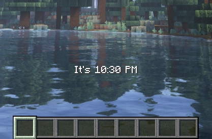
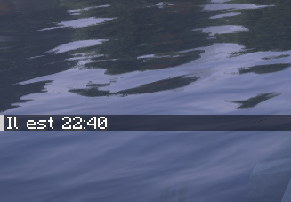

# IRL Time Minecraft Mod

## Description

This Minecraft mod displays the IRL time every 5 minutes.

## Configuration

Open `./config/irl-time-mod.json` and edit properties :
* `format` Defines how the time is formatted. Default is `hh:mm a` (eg: 11:49 PM).
* `prefix` String displayed before the time. Default: `"It's "`
* `overlay` (boolean) Indicates whether the message is displayed as an overlay or not.

## Screenshots

* Overlay:

  

* In chat:

  

## Contributing

We welcome contributions to this project! If you have an idea for improvement or have found a bug, please feel free to open an issue. Pull requests are also greatly appreciated.